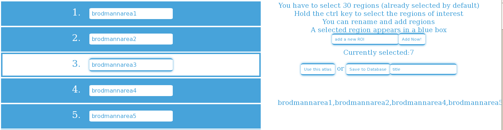
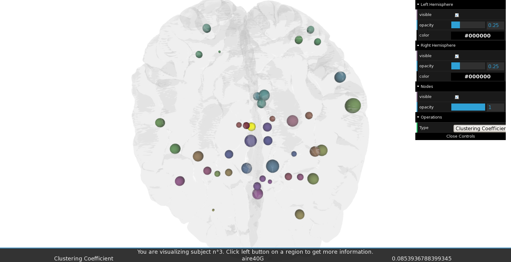

.. PIGAL documentation master file, created by
   sphinx-quickstart on Mon Nov 25 11:24:13 2013.
   You can adapt this file completely to your liking, but it should at least
   contain the root `toctree` directive.

.. |br| raw:: html

    

.. |Fig11| image:: /images/APPmatrixtxt2.png
   :width: 100% 

.. |Fig16|  image:: images/APPcoordstxt.png
   :width: 100% 

.. |Fig22|  image:: images/APPcsvfile.png
   :width: 100% 

.. |Fig35|  image:: images/APPstatisticslocal2.png
   :width: 100% 

Tutoriel d'utilisation 
=================================

Execution
-----------------
Pour exécuter PIGAL, deux cas de |Figure possibles :
	* Exécuter PIGAL sur un serveur local.
		Si vous avez accès aux codes sources de PIGAL et que vous avez installées toutes les dé- |br|
		pendances requises, depuis une console dans le fichier source (branches) de PIGAL, ouvrir |br|
		une console et taper : |br|
		python manage.py runserver & |br|
		firefox "http ://127.0.0.1 :8000" & |br|
		Par défaut le port utilisé est le 8000. Cependant il est possible de choisir votre propre port |br|
		en le spécifiant lorsle de l'appel python : |br|
		python manage.py runserver 8080 & |br|
		firefox "http ://127.0.0.1 :8080" & |br|
	
	* Se connecter à un serveur où PIGAL est exécuté.
		Si PIGAL est accessible via une url, il suffit de se connecter à cet url. Ouvrez votre navigateur |br|
		et connectez vous à cet url ou via une console : |br|
		firefox "http ://url-where-it-is-installed.something" & |br|

une fois sur l'application, il y a deux modes d'utilisation possible. le mode déconnecté et le mode
connecté. |br|
	* Le mode déconnecté, qui permet d'utiliser le logiciel avec un statut de visiteur. Ce mode |br|
		risque d'entrainer des comportements inatendus si une autre personne utilise le logiciel |br|
		en même temps. Et toutes les informations utilisées seront accessibles par tous les autres |br|
		utilisateurs.
	* Le mode connecté, qui permet d'utiliser le logiciel avec un statut privé. Ce mode risque est |br|
		sécurisé et permet de s'assurer qu'il n'y aie pas de conflit avec les autres utilisateurs. De |br|
		plus les données des sessions de ce mode sont privées et toutes les matrices ajoutées sont |br|
		privées. Pour utiliser PIGAL en mode privé, vous devez vous inscrire puis vous connecter. |br|
		Pour ce faire, cliquez sur l'icône "Login/Signup" en haut à gauche de l'écran. |br|

En cas de problème
-----------------
Ajoutez à l'url /PIGALAPP/ la petite solution reset : |br|
/PIGALAPP/reset |br|
Cette fonction réinitialisera PIGAL à son état d'origine mais gardera néanmoins toutes vos |br|
données en mémoire (Jeux de données et résultats). |br|
Si vous rencontrez à nouveau des problèmes, n'hésitez pas à entrer en contact avec le la- |br|
boratoire et à envoyer un mail, pour décrire ce qui a causé ce bug. De manière plus générale, |br|
n'hésitez pas à faire remonter un bug sur le github de la documentation de PIGAL disponible à |br|
l'adresse : |br|
https ://github.com/jcketz/PIGAL |br|

Jeux de données
-----------------

PIGAL est basé sur l'utilisation de matrices de corrélation acquises en se servant d'atlas
et des fichiers de coordonnées qui y sont liés. De ce fait, il est primordial d'avoir à disposition
ces fichiers ou de les préparer afin qu'ils respectent un bon format de fichier permettant d'être
ajoutés et traités par le programme PIGAL.

Sujet unique
~~~~~~~~~~~~~~~~~~~~~~

Pour utiliser PIGAL avec un sujet unique, dans l'interface de PIGAL, sélectionner l'onglet
''Dataset''. L'onglet ''Single Patient''. est activé par défaut. Il est nécessaire d'avoir en possession
une matrice de corrélation. Cette dernière doit être au format .mat d'un objet MATLAB®
(Un objet matlab pouvant contenir beaucoup d'informations, les matrices reconnues par PIGAL
doivent être contenue dans une matrice MATLAB® appelée 'CIJ','CIJctx','cij') ou au format.txt
et se présentant comme suit.

|Fig11|

*Exemple de matrice au format .txt. Chaque ligne de la matrice doit être une ligne du
fichier texte et chaque valeur doit être séparée des autres par une tabulation ou une virgule.* |br|

Pour l'atlas utilisé, il y a deux possibilités :
	* Soit d'utiliser un atlas déjà présent dans la base de données de PIGAL, auquel cas, il suffit |br|
		de sélectionner l'atlas correspondant dans le menu déroulant. |br|

|Fig12|
*Interface de sélection d'un patient à analyser*

	* Soit d'en ajouter un via le module destiné à cet effet sur le côté droit de la page de l'onglet ''Dataset''.

|Fig13|
*Module d'ajout d'un atlas* |br|
L'atlas à ajouter devra être au format .txt et fournir la liste des labels des régions d'intérêts |br|
classés dans l'ordre désiré. |br|

|Fig14|
*Format de l'atlas désiré. Le titre est optionnel mais, s'il est présent, doit être entre
crochets.*

Il en va de même pour les fichiers de coordonnées des régions de l'atlas permettant d'afficher  |br|
les régions dans le maillage 3D. Soit on sélectionne le fichier déjà dans la base de données, soit |br|
on peut ajouter un fichier de coordonnées via le module destiné à cet effet sur le côté droit de |br|
la page de l'onglet '' Dataset ''. |br|

|Fig15|
*Module d'ajout d'un fichier de coordonnées*

|Fig16|
*Format du fichier de coordonnées. Donne les triplets de coordonnées, x,y,z dans l'espace
MNI pour les centres des régions d'intérêt*

Dans le cas ou le nombre de régions entre la matrice entrée et le nombre de régions de |br|
l'atlas sélectionné seraient différents, un pop-up s'affiche et permet de sélectionner, de retirer, |br|
de renommer ou d'ajouter des régions d'intérêt. Cet écran s'affichera tant que les nombres de |br|
régions ne seront pas identiques. |br|

|Fig17|
*Il faut maintenir la touche ctrl du clavier pour sélectionner le nombre de régions
d'intérêt désirées. Une région sélectionnée apparaît dans une case bleue. Les régions peuvent
être renommées et de nouvelles ajoutées*

Plusieurs sujets
~~~~~~~~~~~~~~~~~~~~~~
**Préparation des données**

Pour traiter le cas d'un jeu de données plus important, il est possible d'importer un fichier |br|
compressé au format .zip dans l'onglet ''Dataset''et Several patients de PIGAL. Le fichier .zip |br|
doit respecter ces conditions : |br|
-Contenir les matrices de connectivité à importer dans un répertoire appelé matrix |br|
-Contenir, si besoin*, les atlas à importer dans un répertoire appelé atlas |br|
-Contenir, si besoin*, les fichiers de coordonnées à importer dans un répertoire appelé coords |br|
-Contenir un fichier au format .csv comportant les informations relatives aux sujets : |br|

*Si besoin signifie que ces répertoires et les fichiers d'atlas et de coordonnées ne sont pas |br|
nécessaires si ces derniers sont déjà stockés dans la base de données de PIGAL (voir la liste des |br|
atlas présents dans le menu déroulant de PIGAL) |br|

|Fig18|
*Contenu du fichier zip*

|Fig19|
*Exemple de contenu du répertoire atlas, ce fichier peut contenir plusieurs atlas*

|Fig20|
*Exemple de contenu du répertoire coords, ce fichier peut contenir plusieurs fichiers de
coordonnées*

|Fig21|
*Exemple de contenu du répertoire matrix, ce fichier peut contenir plusieurs fichiers de
matrices*

Le fichier csv doit se présenter comme suit : Ce fichier doit contenir une première ligne |br|
d'entête avec des champs obligatoires : |br|
• IDENTIFIER : Le nom que vous souhaitez donner à votre sujet, un identifiant de préférence |br|
unique. |br|
• MATRIX : Le nom du fichier de la matrice de connectivité du sujet. Ce champs doit |br|
contenir l'extension du fichier (.mat ou .txt) |br|
• ATLAS : Le nom du fichier .txt de l'atlas utilisé (ne pas écrire l'extension). |br|
• COORDINATES : Le nom du fichier .txt du fichier de coordonnées utilisé (ne pas écrire |br|
l'extension). |br|
• GROUP : Le nom du(des) groupe(s) auquel(s) appartient le sujet. |br|
Le nom de fichier des matrices doit contenir l'extension du fichier (.mat ou .txt), les autres |br|
extensions ne sont pas nécessaires car étant des fichiers (.txt) |br|
Le séparateur pour les champs est la virgule. La première ligne du fichier aura donc la forme : |br|
IDENTIFIER,MATRIX,ATLAS,COORDINATES,GROUP |br|

|Fig22|
*Exemple de fichier CSV présentant les données*

Il est possible d'ajouter des champs au tableau qui sera affiché en ajoutant les lignes comme suit : |br|
identifier,MATRIX,ATLAS,COORDINATES,GROUP,age,city |br|
AS1,regionsASsuj1.mat,labels_AS,mni_AS,1,25,Paris |br|
Les matrices ajoutées et les sessions sont privées si vous utilisez PIGAL en mode connecté, |br|
cependant les atlas et les fichiers de coordonnées chargés sont publics, les autres utilisateurs |br|
pourront les utiliser à leur convenance. |br|

**Importation et utilisation dans PIGAL** |br|

Une fois les données préparées dans votre fichier Zip, tout est prêt à être importé dans PIGAL. |br|
Pour ce faire, dans l'interface de PIGAL, sélectionner l'onglet ''Dataset''. Puis l'onglet |br|
''Several Patients''. Cliquez ensuite sur le bouton parcourir et sélectionnez votre fichier ZIP. Patientez, |br|
un tableau va apparaître. Si ce dernier tarde à se montrer, vous pouvez recharger la page. |br|

Il est dès à présent possible de modifier directement le tableau, ce qui modifiera directement |br|
les informations de la session. Chacune des cases autres que celle de la colonne ID du tableau |br|
peut être éditée à volonté. Les cases atlas proposent un menu déroulant avec la liste des atlas |br|
disponibles, les cases coordinates proposent la liste des fichiers de coordonnées disponibles et les |br|
colonnes dont le titre contiennent le mot date proposent un calendrier. |br|

|Fig23| 
*Grille éditable du jeu de données importé*

Pour calculer et visualiser les mesures de graphe pour un sujet de cette liste. Il faut le séléctionner |br|
avec son ''IDENTIFIER'' dans le menu déroulant et cliquer sur le bouton ''compute |br|
visualization''. Dès lors, il est possible d'extraire les informations du graphe du patient sélectionné. |br|

Analyse
-----------------
L'onglet ''Analysis'' de PIGAL est accessible lorsqu'un sujet valide a été sélectionné dans |br|
la partie ''Dataset'' . |br|

Un sujet est considéré comme valide si le nombre de régions de l'atlas et de la matrice du |br|
sujet sélectionné correspondent. |br|

En cliquant sur le bouton ''Extract Graph Features'', un pop-up s'ouvre permettant de |br|
sélectionner dans le menu accordéon les opérations disponibles que PIGAL permet d'effectuer |br|
sur la matrice et le graphe qui y est lié. Par défaut, toutes les opérations autres que les seuillages |br|
sont séléctionnées. Il est possible, en cliquant sur les icônes plus et moins sur le côté droit, d'inverser |br|
la sélection d'une opération ou d'une catégorie d'opérations. |br|

Certaines opérations appartiennent à plusieurs groupes. Le fait de retirer une opération de la |br|
sélection dans un groupe la retirera dans tous les groupes auxquels elle appartient. |br|

Cliquer sur le bouton ''compute graph measures'' exécutera la fonction d'extraction des |br|
caractéristiques du graphe et affichera l'avancement des opérations à l'écran. Le détail s'actualise |br|
toutes les deux secondes. Le pop-up se fermera à la fin du calcul. |br|

|Fig24|
*Page de sélection des opérations à effectuer sur le graphe*

A la fin du calcul, les résultats sont affichés directement dans l'onglet ''Analysis''. Les valeurs globales  |br|
sont rangées dans un tableau. Les valeurs locales sont affichées à la suite sous |br|
forme d'histogrammes interactifs permettant d'observer le détail des valeurs locales de manière |br|
plus représentative. Pour l'affichage des histogrammes,les valeurs sont affichées par défaut dans |br|
l'ordre des régions du fichier d'atlas. Cependant, il est possible d'afficher les valeurs par ordre |br|
croissant ou décroissant. |br|

|Fig25|
*Page de détail des opérations en cours et effectuées*

|Fig26|
*Affichage des résultats des mesures globales*

|Fig27|
*Affichage d'histogramme pour les valeurs locales : exemple avec le coefficient de
regroupement local*

Visualisation
-----------------
L'onglet ''Visualization'' de PIGAL est accessible lorsqu'un sujet valide a été sélectionné |br|
dans la partie ''Dataset'' |br|

La visualisation matricielle et circulaire
~~~~~~~~~~~~~~~~~~~~~~
La visualisation matricielle et circulaire obtenue en cliquant sur le bouton ''Interactive Matrix |br|
and Irimia Representation'' permet de donner une idée plus claire des connexions existantes |br|
entre les régions. |br|

|Fig28|
*Visualisation de toute la matrice*

|Fig29|
*Visualisation des connexions d'une région sélectionnée*

Il est possible de cliquer sur une région pour savoir à quelles autres régions de l'atlas sélectionn |br|
ée cette dernière est connectée. |br|

La visualisation 3D
~~~~~~~~~~~~~~~~~~~~~~
Accessible après analyse d'un sujet. |br|

|Fig30|
*Visualisation en 3 dimensions des régions d'intérêt*

Statistiques
-----------------
Dans l'onglet ''Statistics'' de PIGAL, l'utilisateur doit choisir les groupes d'utilisateurs qu'il |br|
veut comparer. Une fois les groupes choisis, il peut cliquer sur le bouton ''Extract Groups Features |br|
Statistics''. |br|

Si les groupes choisis sont valides, un pop-up s'ouvre permettant de sélectionner dans le menu accord |br|
éon les opérations disponibles que PIGAL permet d'effectuer sur les matrices et les graphes |br|
qui y sont liés dans les groupes considérés. Par défaut, toutes les opérations autres que les |br|
seuillages sont séléctionnées. Il est possible, en cliquant sur les icônes plus et moins sur le côté |br|
droit, d'inverser la sélection d'une opération ou d'une catégorie d'opérations. |br|

Certaines opérations appartiennent à plusieurs groupes. Le fait de retirer une opération de la |br|
sélection dans un groupe la retirera dans tous les groupes auxquels elle appartient. |br|

Cliquer sur le bouton ''compute graph measures'' executera la fonction d'extraction des |br|
caractéristiques du graphe pour chaque sujet de chaques groupes et affichera l'avancement des |br|
opérations à l'écran. Le détail s'actualise toutes les deux secondes. Des tests statistiques de |br|
Student sont enfin calculées et les résultats sont affichés sur la page de l'onglet ''statistics'' |br|
lorsque le pop-up se ferme à la fin du calcul. |br|

|Fig31|
*Page de sélection des opérations à effectuer sur le graphe*

|Fig32|
*Page de détail des opérations en cours et effectuées*

Il est alors possible de choisir dans le menu déroulant d'afficher la moyenne des sujets du |br|
groupe 1, celle du groupe 2, les valeurs du test statistique ou la valeur de p. |br|

|Fig33|
*Affichage de la valeur de p du test statistique de Student pour les mesures globales des groupes choisis*

|Fig34|
*Affichage d'histogramme pour les valeurs locales : exemple avec le diversité des liens
et les valeurs de p. En rouge les valeurs significativement différentes entre les deux groupes. Une
valeur est considérée significative si sa valeur de p est inférieure à 1 sur le nombre de patients.
Ce qui est généralement plus sélectif que le p < 0.05 usuellement utilisé*

|Fig35|
*Affichage d'histogramme pour les valeurs locales : exemple avec la centralité d'interm
édiarité et les valeurs du test statistiques. L'échelle s'ajuste aux valeurs à afficher.*

